# Hello, SQL!

作为万里长征的第一步，在这个任务中我们会构建起 RisingLight 数据库的基本框架，并且使它能够运行最简单的 SQL 语句。

<!-- toc -->

## 背景知识

### 数据库

数据库是结构化数据的有组织集合。它通常是大部分应用存储数据的核心组件。

针对不同的应用场景，数据库演化出了非常多的类型。按数据模型来分，有传统的关系数据库、对象、文档、KV、图、流、时序数据库等。
按业务特点来分，则主要有事务型（OLTP）和分析型（OLAP）两种。其中前者以增删改为主，后者以查询为主。
他们内部的区别主要体现在存储格式上：事务型一般采用按行存储，而分析型则采用列式存储。

我们的 RisingLight 是一个简单的分析型关系数据库。

### SQL

SQL 是数据库领域最流行的编程语言。它的全称是 Structured Query Language（结构化查询语言），用来访问和处理数据库中的数据。

SQL 语言的背后是 **关系代数** 模型，具有非常坚实的理论基础。

关于 SQL 语言的更多介绍可以参考 [CMU 15-445] Lecture 01/02 的相关内容。

[CMU 15-445]: https://15445.courses.cs.cmu.edu/fall2021/schedule.html

由于 SQL 在数据库中的广泛应用，我们的 RisingLight 也采用 SQL 作为操作数据库的唯一接口，并且后续会以 SQL 语言特性为导向进行相关功能的开发。

### DuckDB

[DuckDB] 是一个轻量级嵌入式分析型数据库，可以类比作 OLAP 领域的 SQLite。

你可以按照[这里](https://duckdb.org/docs/installation/)的说明下载安装 DuckDB，然后在其中输入 SQL 命令进行体验。

RisingLight 的功能定位和 DuckDB 很相似，并且一定程度上参考了 DuckDB 的设计与实现。
如果大家在实现数据库的过程中遇到困难，那么 DuckDB 是一个很好的学习和参考对象。

[DuckDB]: https://duckdb.org

### SqlLogicTest

[SqlLogicTest] 是一个检验数据库执行结果正确性的测试框架，最早被用来测试 SQLite。它定义了一种脚本语言来描述 SQL 测试语句和期望输出结果。

[SqlLogicTest]: https://www.sqlite.org/sqllogictest/doc/trunk/about.wiki

以一个最简单的测试为例：

```
query I         # query 表示查询，I 表示期望输出是一个整数
SELECT 1        # 输入的 SQL 语句
----            # 分隔符，接下来描述期望结果
1               # 期望输出 1，测试器会检查它和数据库输出的字符串是否一致
```

我们的 RisingLight 就使用了 sqllogictest 来做端到端测试。你可以在 [`code/sql`] 文件夹下找到每个任务对应的 sqllogictest 测试脚本。

[`code/sql`]: https://github.com/risinglightdb/risinglight-tutorial/tree/main/code/sql

### Rust

RisingLight 使用 Rust 语言编写！

[Rust] 是新时代的系统级编程语言，主要为了解决 C/C++ 中的内存安全问题而生。
Rust 在不使用垃圾回收的前提下，通过引入所有权和生命周期等机制在编译期保证程序不会非法使用内存，让程序既运行高效又安全可靠。
这使得它成为编写数据库系统的很好选择。

[Rust]: https://www.rust-lang.org

然而凡事都有两面，Rust 严格的语言机制使得它具有很高的学习门槛。并且一些在其它 OOP 语言中能轻而易举完成的操作，到了 Rust 中就很难实现。
我们在编写 RisingLight 的过程中也遇到了这些问题，在后面的章节中我们也会具体介绍应该如何处理或绕过它们。

整体来讲，使用 Rust 编写数据库能为我们带来很多好处。大家在后面的 coding 过程中可以亲自体会！

## 任务目标

简单介绍完了背景知识，下面我们就可以开始动手了！

在第一个任务中你需要从零开始搭起一个最简单的数据库框架。它需要提供一个可交互的终端，能够接收用户输入的 SQL 语句并输出结果：

```sql
> SELECT 'Hello, world!'
Hello, world!
```

这就是我们要支持的第一个 SQL 命令：`SELECT` 一个常数，然后输出它：）

除此之外，我们还要搭起一个端到端测试框架，能够运行第一个 sqllogictest 脚本：[`01-01.slt`]。

[`01-01.slt`]: https://github.com/risinglightdb/risinglight-tutorial/tree/main/code/sql/01-01.slt


## 整体设计

为了完成上面的目标，我们需要实现四个简单的模块：

* Parser：负责解析 SQL 语句并生成抽象语法树（AST）
* Executor：负责执行解析后的 SQL 语句
* Shell：一个可交互的命令行终端
* Test：一个基于 sqllogictest 脚本的测试框架

它们之间的关系如图所示：



我们可以把它们实现到不同的文件里：

```
src
├── parser.rs
├── executor.rs
├── lib.rs
├── main.rs
└── test.rs
```

其中 lib 是数据库本体，会被编译成一个程序库。main 是 `cargo run` 运行的可执行文件，test 是 `cargo test` 运行的测试。

### Parser

为了读懂用户输入的 SQL 命令，你首先需要一个 SQL 解析器（Parser）。对于上面这条 SQL 语句来说，自己手写一个字符串解析就足够了。
不过随着之后 SQL 语句越来越复杂，解析 SQL 的复杂度也会与日俱增。既然我们又不是编译原理课，Parser 并不是我们关注的重点，
因此在 RisingLight 中我们推荐大家使用第三方库 [sqlparser-rs] 来完成 SQL 解析的工作，具体用法可以参考它的[文档]。

[sqlparser-rs]: https://github.com/sqlparser-rs/sqlparser-rs
[文档]: https://docs.rs/sqlparser/0.13.0/sqlparser/

简单来说，我们可以创建一个 [`Parser`] 对象，然后使用 [`parse_sql`] 方法将字符串解析成一颗抽象语法树（AST）。
抽象语法树的各个节点定义在 [`ast`] 模块中，我们可以从根节点 [`Statement`] 开始，一级一级地查看里面的内容。

[`Parser`]: https://docs.rs/sqlparser/0.13.0/sqlparser/parser/struct.Parser.html
[`parse_sql`]: https://docs.rs/sqlparser/0.13.0/sqlparser/parser/struct.Parser.html#method.parse_sql
[`ast`]: https://docs.rs/sqlparser/0.13.0/sqlparser/ast/index.html
[`Statement`]: https://docs.rs/sqlparser/0.13.0/sqlparser/ast/enum.Statement.html

当我们要实现解析某种特定的 SQL 语句时，一个好办法是直接 debug 输出解析后 AST 的完整结构，观察我们想要的东西分别被解析到了哪个位置上，然后在代码中提取相应的内容。

```rust,no_run
use sqlparser::dialect::PostgreSqlDialect;
use sqlparser::parser::Parser;

fn main() {
    let mut sql = String::new();
    std::io::stdin().read_line(&mut sql).unwrap();
    let stmts = Parser::parse_sql(&PostgreSqlDialect {}, &sql);
    println!("{:#?}", stmts);
}
```

例如我们使用上述代码，输入 `SELECT 'Hello, world!'`，就会得到以下输出：

```
Ok(
    [
        Query(
            Query {
                with: None,
                body: Select(
                    Select {
                        distinct: false,
                        top: None,
                        projection: [
                            UnnamedExpr(
                                Value(
                                    SingleQuotedString(
                                        "Hello, world!",
                                    ),
                                ),
                            ),
                        ],
                        from: [],
                        lateral_views: [],
                        selection: None,
                        group_by: [],
                        cluster_by: [],
                        distribute_by: [],
                        sort_by: [],
                        having: None,
                    },
                ),
                order_by: [],
                limit: None,
                offset: None,
                fetch: None,
            },
        ),
    ],
)
```

### Executor

在完成 SQL 解析得到抽象语法树后，我们就可以根据 SQL 的语义来执行它。

对于 `SELECT 'Hello, world!'` 来说，你只需要根据上面的结构，逐级提取出 `"Hello, world!"` 字符串即可：

```rust,no_run
use sqlparser::{SetExpr, Statement};

match stmt {
    Statement::Query(query) => match &query.body {
        SetExpr::Select(select) => {
            // ...
        }
        _ => todo!("not supported statement: {:#?}", stmt),
    },
    _ => todo!("not supported statement: {:#?}", stmt),
}
```

随着之后 SQL 语句变得越来越复杂，我们会在 Parser 和 Executor 之间加入更多的模块。来处理变量绑定和调整执行计划。

### 错误处理

目前为止我们只关注了程序正常执行的情况，但在实际环境下数据库中可能出现各种各样的错误，最常见的比如用户输入了不合法的 SQL 语句。
在开发初期遇到这种情况时，我们可以简单粗暴地直接 panic 中止程序。但是一个合格的程序应该向用户报告错误，而不影响自身正常运行：

```
> SELET 1
parse error: Expected an SQL statement, found: SELET
> |
```

Rust 语言中没有 `throw-catch` 的异常机制，而是通过返回 `Result` 类型来处理错误。
目前在 Rust 生态中错误处理的最佳实践是使用 [thiserror] 库来定义错误类型。

[thiserror]: https://docs.rs/thiserror/1.0.30/thiserror/index.html

在我们的数据库中，每个模块都可能发生一些错误。例如 Parser 模块会返回 sqlparser 定义的 [ParserError]，Executor 未来可能在读写文件时返回标准库定义的 `std::io::Error`。
而在实现顶层结构时，就需要定义一种 Error 类型把它们聚合起来。我们推荐大家使用下面的风格来实现它：

[ParserError]: https://docs.rs/sqlparser/0.13.0/sqlparser/parser/enum.ParserError.html

```rust,no_run
pub use sqlparser::parser::ParserError;

/// The error type of execution.
#[derive(thiserror::Error, Debug)]
pub enum ExecuteError {
    // ...
}

/// The error type of database operations.
#[derive(thiserror::Error, Debug)]
pub enum Error {
    #[error("parse error: {0}")]
    Parse(#[from] ParserError),
    #[error("execute error: {0}")]
    Execute(#[from] ExecuteError),
}
```

这样，每个模块都返回自己定义的错误类型，在顶层模块中使用 `?` 就可以完成自动类型转换：

```rust,no_run
mod parser {
    pub fn parse(sql: &str) -> Result<..., ParserError> {...}
}
mod executor {
    pub fn execute(...) -> Result<..., ExecuteError> {...}
}

fn run(sql: &str) -> Result<..., Error> {
    let stmt = parser::parse(sql)?;
    let output = executor::execute(stmt)?;
    Ok(output)
}
```

### Shell

实现一个朴素的可交互终端非常简单，只需使用标准库提供的 `stdin` 输入，`println!` 宏输出即可。

但是，一个对用户友好的终端一般还需要支持光标移动和历史记录等功能
（如果你使用 stdin 读取用户输入，那么在按上下左右键时会出现一些奇怪的控制字符）。
而自己实现这些未免枯燥乏味，因此我们也可以使用第三方库 [rustyline] 来帮我们解决这个问题。

[rustyline]: https://docs.rs/rustyline/9.1.1/rustyline/

一个简单的用法如下：

```rust,no_run
fn main() {
    let mut rl = rustyline::Editor::<()>::new();
    loop {
        match rl.readline("> ") {
            Ok(line) => {
                rl.add_history_entry(&line);
                println!("Line: {:?}", line);
            }
            Err(ReadlineError::Interrupted) => {}
            Err(ReadlineError::Eof) => break,
            Err(err) => println!("Error: {:?}", err),
        }
    }
}
```

### Test

测试是系统开发中的重要环节。
这部分我们实现了自己的 [sqllogictest] 库来做测试脚本的解析和运行。

你只需实现一个 Database struct，并为它实现 [`DB`] trait。然后就可以使用 [`Runner`] 来运行测试了：

```rust,no_run
impl sqllogictest::DB for Database {
    type Error = Error;
    fn run(&self, sql: &str) -> Result<String, Self::Error> {...}
}

#[test]
fn test() {
    let script = std::fs::read_to_string(Path::new("../sql/01-01.slt").unwrap();
    let mut tester = sqllogictest::Runner::new(Database::new());
    tester.run_script(&script);
}
```

我们提供了一份完整的测试框架代码 [test.rs]，你可以直接把它复制到你的项目中。

在运行测试时，你可以开启 `RUST_LOG=info` 和 `RUST_BACKTRACE=1` 这两个环境变量。开启这两个选项可以方便定位运行过程的错误。

[sqllogictest]: https://docs.rs/sqllogictest/0.1.0/sqllogictest/
[`DB`]: https://docs.rs/sqllogictest/0.1.0/sqllogictest/trait.DB.html
[`Runner`]: https://docs.rs/sqllogictest/0.1.0/sqllogictest/struct.Runner.html#method.run_script
[test.rs]: https://github.com/risinglightdb/risinglight-tutorial/tree/main/code/01-01/src/test.rs

### 总结

以上我们介绍了实现一个最简单数据库框架所需的四个模块，每个模块的实现思路和值得关注的问题。
在每个模块中我们都使用了一个第三方库来快速实现某种功能，这也是 Rust 语言生态的一大优势。

下一步我们将实现 Catalog，为数据定义它的结构，从而为建表和插入做准备。
