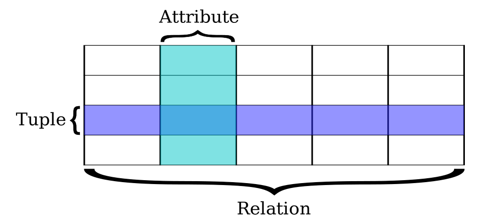

# Catalog

关系型数据库存储**结构化**的数据。其中有一部分描述这些结构的“元数据”就被称为 Catalog。
在这个任务中我们将学习关系数据库的基本模型，为数据库定义好 Catalog 相关的数据结构，从而为后面插入数据做准备。

<!-- toc -->

## 背景知识

数据库中包含了各种各样的对象。

### 表（Table）

我们最熟悉的对象是 **表（Table）**，它是关系型数据库中存储数据的基本单位。

一张表可以理解为一个**二维数组**，它由纵向的**列**和横向的**行**组成。
每一列表示数据的某种**属性（Attribute）**，每一行则表示一条数据**记录（Record）**。

例如下面展示了一个简单的记录学生信息的表：

|id| name | age |
|--|------|-----|
| 1| Alice|  18 |
| 2| Bob  |  19 |
| 3| Eve  |  17 |

在偏理论的语境下，表还有一个更正式的名字叫做 **关系（Relation）**，因为它蕴含了数据属性之间的关系。
其中，每一行又被称为 **元组（Tuple）**。



表中的每一列都有自己的名字和类型。比如在上面的表中，第一列的名字是 `id`，数据类型是 `INTEGER`（整数）。而第二列的数据类型是 `VARCHAR`（字符串）。

各种数据库都会支持大量的数据类型，其中比较常见的有下面几种：

* `INTEGER`：有符号整数
* `DOUBLE`：浮点数
* `CHAR`：定长字符串
* `VARCHAR`：变长字符串
* `DECIMAL`：十进制定点数，用来做无误差的精确运算（常用在交易系统中表示账户金额）
* `DATE`：日期和时间

部分类型还可以有自己的关联参数，例如：

* `CHAR(n)` 表示长度为 `n` 的字符串
* `VARCHAR(n)` 表示最大长度为 `n` 的字符串
* `DECIMAL(m, d)` 表示有效数字 `m` 位、小数点后 `d` 位的定点数。 

表中每一列的数据都只能存储指定的类型，他们所有合法值的集合称为 **数据域（Data Domain）**。
在一般情况下，所有数据域都包含一个特殊的 **空值 `NULL`**。也就是说，表中的每个位置默认都可以为空。

除了名字和类型以外，每一列还有一些可选的属性：

* **非空** `NOT NULL`：表示这一列的值不能为 `NULL`。

* **唯一** `UNIQUE`：表示这一列的值不能重复。

* **主键** `PRIMARY KEY`：主键能够唯一地表示表中的一行，一般用来作为索引。
    
    因此主键一定是唯一且非空的，并且每个表只能有一个主键。例如在上面的学生表中，`id` 就可以作为主键。

在 SQL 语言中，**数据定义语言（Data Definition Language，DDL）** 可以用来描述一个表的模式信息。
比如上面的学生表就可以通过以下语句来定义：

```sql
CREATE TABLE student (
    id      INTEGER PRIMARY KEY,
    name    VARCHAR NOT NULL,
    age     INTEGER
);
```

我们会在下一个任务中具体实现它：）

### 视图（View）

**视图（View）** 是一种虚拟的表，它表示一条 SQL 语句的查询结果。每次查看视图时，数据库都会执行一遍查询以获取最新的结果。

例如，我们可以用 DDL 创建一个关于学生名字的视图：

```sql
CREATE VIEW student_name AS
SELECT name FROM student;
```

类似地还有另一个概念叫做 **物化视图（Materialized view）**。它将查询结果缓存下来，并在特定时期进行更新。

### 索引（Index）

**索引（Index）** 是对数据库中某一列或多列数据进行排序的结构，用来快速查询表中的记录。

关系型数据库一般会对主键自动创建索引。如果还有其它的列需要大量随机访问或范围查询，就可以手动为它们创建索引来加速。
例如，我们可以用 DDL 创建学生名字的索引：

```sql
CREATE INDEX student_name ON student (name);
```

索引的经典实现是 B+ 树，这是一种适合存储在磁盘上的平衡树。

由于它的实现比较复杂，因此在 RisingLight 中我们暂时不会涉及索引。
<!-- 以后可以加上？ -->

### 模式（Schema）

**模式（Schema）** 是数据库对象的集合。上面提到的表、视图、索引等都可以被包含在一个 Schema 当中。
对于有用户权限的数据库系统，在 Schema 上可以指定不同的用户权限。

在 DDL 中我们可以先创建一个 Schema，然后在这个 Schema 内部创建其它对象：

```sql
CREATE SCHEMA school;
CREATE TABLE school.student (...);
```

部分数据库（比如 Postgres）在 Schema 之上还有一个层级 **Database**，一个 Database 可以包含多个 Schema。
不过其它大部分数据库都没有这个额外的层级：在 MySQL 中 `DATABASE` 和 `SCHEMA` 是同义词，在 SQLite 或 DuckDB 这类简单的嵌入式数据库中则不存在 `DATABASE` 这个关键词。

总的来看，一个数据库内部对象的层次结构可以表示成这样的一棵树：



当前任务的目标就是实现描述它的数据结构。

## 任务目标

实现 Catalog 相关数据结构，包括：Database，Schema，Table，Column 四个层级。

能够准确描述上面提到的这种表：

```sql
CREATE TABLE student (
    id      INTEGER PRIMARY KEY,
    name    VARCHAR NOT NULL,
    age     INTEGER
);
```

除此之外，这个任务没有新增的 SQL 测试。

## 整体设计

首先，我们提供一种可供参考的接口设计：

```rust,no_run
// 整个数据库的 Catalog 根节点
pub struct DatabaseCatalog {...}

impl DatabaseCatalog {
    pub fn add_schema(&self, name: &str) -> SchemaId {...}
    pub fn get_schema(&self, id: SchemaId) -> Option<Arc<SchemaCatalog>> {...}
    pub fn del_schema(&self, id: SchemaId) {...}
}

// 一个 Schema 的 Catalog
pub struct SchemaCatalog {...}

impl SchemaCatalog {
    pub fn id(&self) -> SchemaId {...}
    pub fn name(&self) -> String {...}
    pub fn add_table(&self, name: &str, columns: &[(String, ColumnDesc)]) -> TableId {...}
    pub fn get_table(&self, id: TableId) -> Option<Arc<TableCatalog>> {...}
    pub fn del_table(&self, id: TableId) {...}
}

// 一个表的 Catalog
pub struct TableCatalog {...}

impl TableCatalog {
    pub fn id(&self) -> TableId {...}
    pub fn name(&self) -> String {...}
    pub fn get_column(&self, id: ColumnId) -> Option<Arc<ColumnCatalog>> {...}
    pub fn all_columns(&self) -> Vec<Arc<ColumnCatalog>> {...}
}

// 一个列的 Catalog
pub struct ColumnCatalog {...}

impl ColumnCatalog {
    pub fn id(&self) -> ColumnId {...}
    pub fn name(&self) -> String {...}
    pub fn desc(&self) -> ColumnDesc {...}
}

// 一个列的完整属性
pub struct ColumnDesc {...}

impl ColumnDesc {
    pub fn is_nullable(&self) -> bool {...}
    pub fn is_primary(&self) -> bool {...}
    pub fn datatype(&self) -> DataType {...}
}

// 一个列的数据类型，包含了“可空”信息
pub struct DataType {...}

impl DataType {
    pub fn is_nullable(&self) -> bool {...}
    pub fn kind(&self) -> DataTypeKind {...}
}

// 一个值的数据类型，不考虑空值
// 为了方便，我们可以直接使用 sqlparser 中定义的类型
pub use sqlparser::ast::DataType as DataTypeKind;
```

为了代码结构清晰，可以把它们拆成多个文件：

```
src
├── catalog
│   ├── mod.rs
│   ├── database.rs
│   ├── schema.rs
│   ├── table.rs
│   └── column.rs
├── types.rs
...
```

由于 Catalog 会在数据库中多个地方被读取或修改，因此我们把它们设计为 可被共享访问 的数据结构（Send + Sync）。
这种 struct 的一个特点就是所有方法都标记 `&self` 而不是 `&mut self`，即使对于修改操作也不例外。
这种模式在 Rust 中被称为 **[内部可变性]**。

[内部可变性]: https://kaisery.github.io/trpl-zh-cn/ch15-05-interior-mutability.html

实现这种模式通常需要定义两层 struct：内层是普通的可变结构，然后在外面包一层锁。

以顶层的 `DatabaseCatalog` 为例：

```rust,no_run
use std::sync::Mutex;

// 外部 Sync 结构
pub struct DatabaseCatalog {
    inner: Mutex<Inner>,    // 对于读多写少的场景，也可以使用 RwLock
}

// 内部可变结构
struct Inner {
    schemas: HashMap<SchemaId, Arc<SchemaCatalog>>,
    // ...
}
```

当我们为外层结构实现方法的时候，需要先 lock 住内部结构，然后去访问 inner：

```rust,no_run
impl DatabaseCatalog {
    pub fn get_schema(&self, schema_id: SchemaId) -> Option<Arc<SchemaCatalog>> {
        let inner = self.inner.lock().unwrap();
        inner.schemas.get(&schema_id).cloned()
    }
}
```

如果函数体过于复杂，也可以把它拆成多个 Inner 对象上的小函数：

```rust,no_run
impl DatabaseCatalog {
    pub fn add_schema(&self, name: &str) {
        let inner = self.inner.lock().unwrap();
        let id = inner.next_id();
        inner.add_schema(id, name);
    }
}

impl Inner {
    fn add_schema(&mut self, schema_id: SchemaId, name: &str) {...}
    fn next_id(&mut self) -> SchemaId {...}
}
```

主要的技巧就是这些，代码本身并不复杂。下一步我们就会基于这里定义的数据结构，来实现 `CREATE TABLE` 创建表操作了！
