# 创建表（`CREATE TABLE`）

在实现了 Catalog 之后，我们就可以使用 `CREATE TABLE` 语句创建数据表：

```sql
CREATE TABLE student (
    id      INTEGER PRIMARY KEY,
    name    VARCHAR NOT NULL,
    age     INTEGER
);
```

这一语句除了解析和执行两个步骤以外，还需要做名称的检查，并将它们与数据库内部对象绑定起来。
这些工作一般是由一个叫做 Binder 的模块完成。

在此任务中，我们将实现一个基础的 Binder，同时拓展 Executor 实现相应的执行逻辑，最终支持 `CREATE TABLE` 语句。

<!-- toc -->

## 背景知识

### Binder

Binder 是整个数据库系统中一个不太起眼但又十分重要的模块。

它的作用是将解析后生成的 AST 和 Schema 信息绑定起来，具体包括：

- 检查输入的名称是否合法、是否有重复、有歧义
- 推断表达式的返回值类型，并检查是否合法
- 将输入的名称转换成内部 ID

比如，对于一个简单的创建表的命令：

```sql
CREATE TABLE student (
    id      INTEGER PRIMARY KEY,
    name    VARCHAR NOT NULL,
    age     INTEGER
);
```

Binder 会依次完成以下工作：

1. 由于 SQL 对大小写不敏感，Binder 会首先将所有名称统一成小写。
2. 对于表名 `student`，自动补全省略的 schema 名。假如当前 schema 是 `school`，那么会将其补全成 `school.student`。
3. 检查 schema 是否存在，并获取它的 Schema ID。
4. 检查 schema 中是否已经存在名为 `student` 的表。
5. 检查列名 `id` `name` `age` 是否合法、是否有重复。
6. 检查列的属性是否合法，例如不能出现两个 `PRIMARY KEY`。
7. 向 AST 中填入绑定后的信息：Schema ID。

对于插入数据的 `INSERT` 语句，例如：

```sql
INSERT INTO student VALUES (1, 'Alice', 18)
```

Binder 需要查询表中每一列的信息，推断表达式的类型，并检查它们是否相符。
换言之，Binder 应该能够识别出以下不合法的插入语句：

```sql
INSERT INTO student VALUES (1)                  -- 存在未指定的 NOT NULL 值
INSERT INTO student VALUES (1, 'Alice', 'old')  -- 类型不匹配
INSERT INTO student VALUES (1, 'Alice', 18+'g') -- 表达式类型不匹配
```

对于更复杂的嵌套查询语句，Binder 还需要根据当前语境，推断出每个名称具体指代哪个对象：

```sql
SELECT name FROM student WHERE sid IN (
--                  ^-----------^ student.sid
    SELECT sid FROM enrolled WHERE class = 'database'
--          ^----------^ enrolled.sid
)
```

可以看出，Binder 干的都是一些比较繁琐的脏活累活。因此后面我们写的 Binder 代码也会比较冗长并且细节琐碎。

## 任务目标

能够创建数据表，支持以下 SQL 语句：

```sql
CREATE TABLE student (
    id      INTEGER PRIMARY KEY,
    name    VARCHAR NOT NULL,
    age     INTEGER
);
```

【练习】支持 `DROP TABLE` 语句，删除数据表：

```sql
DROP TABLE student;
```

【练习】支持 `CREATE SCHEMA` 语句，创建 schema：

```sql
CREATE SCHEMA school;
```

## 整体设计

在加入 Binder 之后，RisingLight 的整个数据处理流程扩展成了这个样子：



其中 Binder 插在了 Parser 和 Executor 之间。
它会将 Parser 生成的 AST 进行处理后，生成一个新的 AST 交给 Executor，在此过程中需要从 Catalog 读取 Schema 信息。
Executor 拿到绑定后的 AST 去执行，在此过程中可能也会再次修改 Catalog（比如创建一个表）。

在代码结构上，我们可能会新增以下文件：

```
src
├── binder
│   ├── mod.rs
│   └── statement
│       ├── mod.rs
│       ├── create.rs
│       └── select.rs
├── executor
│   ├── mod.rs
│   ├── create.rs
│   └── select.rs
...
```

此外还需要对数据库顶层结构进行修改。

### Bound AST

Binder 模块的主要任务是给 Parser 生成的 AST 绑定必要的信息。

由于我们的 Parser 使用了第三方库，不能在它的 AST 结构上扩展新的属性，所以只能定义新的结构来存放这些信息。

例如对于 `CREATE TABLE` 语句来说，绑定后的 AST 应该具有以下信息：

```rust,no_run
// binder/statement/create.rs

/// A bound `CREATE TABLE` statement.
#[derive(Debug, PartialEq, Clone)]
pub struct BoundCreateTable {
    pub schema_id: SchemaId,    // schema name 经过向 catalog 查询转换成了 ID
    pub table_name: String,
    pub columns: Vec<(String, ColumnDesc)>,
}
```

类似地，对于 1.1 中的 `SELECT 1` 语句而言，我们可以只提取出必要的值来保存：

```rust,no_run
// binder/statement/select.rs

use crate::parser::Value;

/// A bound `SELECT` statement.
#[derive(Debug, PartialEq, Clone)]
pub struct BoundSelect {
    pub values: Vec<Value>,
}
```

最后，我们需要定义一个 enum 将各种不同类型的语句聚合起来：

```rust,no_run
// binder/mod.rs

/// A bound SQL statement.
#[derive(Debug, PartialEq, Clone)]
pub enum BoundStatement {
    CreateTable(BoundCreateTable),
    Select(BoundSelect),
}
```

这样，一个 `BoundStatement` 变量就可以表示 Binder 生成的整个 AST 了。

### Binder

接下来，我们实现真正的 `Binder` 对象。它会将 Parser 生成的 AST 转换成一个新的 AST。
由于在绑定过程中会访问 Catalog 的数据，`Binder` 中需要存放一个 Catalog 对象的指针：

```rust,no_run
pub struct Binder {
    catalog: Arc<Catalog>,
}
```

我们在 `Binder` 对象上实现各种 `bind` 方法来完成对不同 AST 节点的处理：

```rust,no_run
use crate::parser::{Query, Statement};

impl Binder {
    pub fn bind(&mut self, stmt: &Statement) -> Result<BoundStatement, BindError> {
        use Statement::*;
        match stmt {
            CreateTable { .. } => Ok(BoundStatement::CreateTable(self.bind_create_table(stmt)?)),
            Query(query) => Ok(BoundStatement::Select(self.bind_select(query)?)),
            _ => todo!("bind statement: {:#?}", stmt),
        }
    }

    fn bind_create_table(&mut self, stmt: &Statement) -> Result<BoundCreateTable, BindError> {
        // YOUR CODE HERE
    }

    fn bind_select(&mut self, query: &Query) -> Result<BoundSelect, BindError> {
        // YOUR CODE HERE
    }
}
```

注意到这些方法都使用了 `&mut self` 签名，这是因为 `Binder` 未来会有内部状态，并且在 bind 过程中还会修改这些状态。
<!-- 例如对于 `SELECT id FROM student` 语句来说，需要首先扫描 FROM 子句记录下表名 `student`，然后访问 `id` 时才能知道它是否是某个表的列。 -->

另外在 bind 过程中还可能产生各种各样的错误，比如名称不存在或者重复等等。
我们将所有可能发生的错误定义在一个 `BindError` 错误类型中（参考 [1.1 错误处理](../01-01-hello-sql.md#错误处理)）：

```rust,no_run
/// The error type of bind operations.
#[derive(thiserror::Error, Debug, PartialEq)]
pub enum BindError {
    #[error("schema not found: {0}")]
    SchemaNotFound(String),
    // ...
}
```

至于具体的 bind 逻辑，大家可以参考背景知识中描述的过程尝试自己实现。

### Executor

在 1.1 中我们实现过一个最简单的执行器，它只是一个函数，拿到 AST 后做具体的执行。
现在我们有了更多类型的语句，并且在执行它们的过程中还需要访问 Catalog。
因此和 Binder 类似，我们现在需要将 Executor 也扩展为一个对象：

```rust,no_run
pub struct Executor {
    catalog: Arc<Catalog>,
}
```

然后在 `Executor` 上实现各种 `execute` 方法来对不同类型的 AST 节点做执行：

```rust,no_run
/// The error type of execution.
#[derive(thiserror::Error, Debug)]
pub enum ExecuteError {...}

impl Executor {
    pub fn execute(&self, stmt: BoundStatement) -> Result<String, ExecuteError> {
        match stmt {
            BoundStatement::CreateTable(stmt) => self.execute_create_table(stmt),
            BoundStatement::Select(stmt) => self.execute_select(stmt),
        }
    }

    fn execute_create_table(&self, stmt: BoundCreateTable) -> Result<String, ExecuteError> {
        // YOUR CODE HERE
    }

    fn execute_select(&self, query: BoundSelect) -> Result<String, BindError> {
        // YOUR CODE HERE
    }
}
```

我们暂时将 Executor 的返回值设定为 `String` 类型，表示语句的执行结果。
在下一个任务中，我们会实现更具体的内存数据类型 `Array` 和 `DataChunk`。
到那时，Executor 的输出就是一段真正的数据了。
