# 存储
# 什么时候需要列存引擎？🤔

数据库用户通常会在分析型 (OLAP) 数据库系统上对大量数据进行统计分析。举个例子，假设我们有一张记录用户点击量的表，记录用户什么时候访问了什么网页，从哪里来，看了多久：

| 点击时间 (time) | URL | 用户名 (username) | 停留时长 (min) (length) | 来源 (referrer) |
|:--|:--|:--|:--|:--|
| 10:00am | risinglightdb/risinglight | user1 | 1 | github.com |
| 10:01am | risinglightdb/risinglight/issues | user2 | 2 | github.com/risinglightdb |
| ... | ... | ... | ... | ... |

对于数据库用户来说，它们关心的一项内容可能是：过去一小时内，有多少用户访问了 risinglight。

```sql
SELECT count(*) FROM table WHERE time >= "10am" AND time <= "11am"
```

行存引擎在盘上将同一行的内容存储在一起，列存引擎将一列的内容存储在一起。接下来我们看看这条 query 在行存和列存引擎上分别需要访问多少数据。



在这个 query 中，我们只需要访问 `time` 列的数据就能获得结果。在行存引擎里，由于同一行的数据是相邻的，取得 `time` 值的同时也需要把同一行的其他信息从盘上读取出来。在列存引擎里，由于一列的数据是相邻存储的，我们只需要把这一列的数据读出来就可以得到结果了。因此，OLAP 数据库系统的数据适合存储在列存引擎中。数据按列存放，可以大大提升分析型查询的速度。

# 列存引擎如何存储数据？💾

## 最简单的“列”存

我们先做一个最简单的假设：用户只有一张表，表只有一列定长类型数据 (i64)。用户写一次就不会再写了。之后用户在表上只跑只读的全表扫描 query。在这种情况下，用什么方式存储数据是最高效的呢？我们从这么几个维度来考虑：
- 空间：数据写到盘上需要占用多少空间。
  - 当我们使用列存引擎存储已经排好序的数据时，相邻的数据大概率会重复。此时若使用 Run-Length 编码 (RLE)，则可以大大减少空间占用。
- 读取：把数据从盘上读到内存里需要多少开销。
  - 如果我们使用一种压缩算法直接对整列做压缩，这就意味着每次要从盘上把一整列读上来，在内存里解压，才能读到原始数据。这就会导致一定的读放大。
考虑到这个场景里用户“扫描全表”、“一次写入”，我们可以选定一种编码方法，按顺序写入数据，一次全部压缩写到盘上。在扫描全表时，一次全部读入并解压。这样可以用最少的空间达到最高效的全表扫描性能。



## 列存索引

用户开始考虑做一些筛选，比如 SELECT count(*) FROM table WHERE x >= 10。其中 x 是这张表的主键。在这种情况下，用户不需要扫描全表了。如果我们依然一次压缩全部写入，在读取的时候就有可能读到大量不需要的数据。因此，我们需要：

- **对列做划分，比如每 64K 做一次压缩，而不是全部写入再压缩。**
  - 计算机的内存是有限的，数据库通常来说都会维护自己的 buffer pool，只缓存一部分盘上的数据。在 RisingLight 的存储引擎中，我们使用 block cache 来缓存这些数据。将数据分块也可以减小缓存换入换出的开销，提升 block cache 的使用率。
- **存储引擎可以在写入时预先根据 x 对列做排序和索引**，记录每一小块的起始 key，从而快速定位 x >= 10 所在的块在什么位置。

这样一来，就可以大大减少扫描 x >= 10 的读取量。我们把存储引擎最小的管理单位称作“块 (Block)”。在 RisingLight 中，Block 的大小通常是 64K - 1MB。每次读取时，先从索引找到 x >= 10 对应的块的位置，然后开始读取并解压缩 block，获得原始数据。

在 RisingLight 中，列文件都使用 .col 后缀存储，索引文件使用 .idx 或者 .sort 后缀存储。



根据主键做筛选只是一个例子（而且在 RisingLight 里面也没有实现）。在 RisingLight 中，按 block 对列做划分的特性可以用来做 filter scan。比如：

```sql
SELECT sum(y) FROM table WHERE x = 10;
```

即使 x 不是主键，也不一定在索引里，现在的设计中我们依然可以减少 I/O 量。我们只需要把 x = 10 的行对应的 y 扫描出来就行了。

## 存储多个列

现在用户的数据不止有一列了，而且每一列的数据类型都不同：

```sql
CREATE TABLE t(c1 int, c2 varchar, c3 float, primary key(v1))
```

数据类型不同，意味着写入时，block 不能根据行对齐。举个例子，在 c1 中，假设前 100 个 i64 数据可以正好塞进一个 block。现在的 c2 列类型是 varchar，每一个数据都是不定长的。它的前 100 行可能塞不满一个 block，也有可能超过一个 block。在这种情况下，我们应该继续保持 block 大小不变，让不同列的同一个位置的 block 包含不同个数的数据；还是保持每个 block 行数相等？



**RisingLight 的选择是不对齐 Block**。这是出于两个考虑：
- Block Cache 更好管理：Block Cache 里的每一项长度几乎相同，只需要限制 Block Cache 的项数就可以很好的估计内存占用。
- I/O 更可控：Block 是最小的管理单元、最小的读盘单元。如果每个 Block 大小几乎相同，每个 I/O 请求的大小就更可控，延迟也更可控。

由多个相同行数的列组成的文件夹被称为 RowSet：一个 RowSet 由 n 个列和 n 个索引组成，每一列包含相同的行数。



## 存储整张表

一个用户表的数据通常不可能一次全部导入，用户往往会往表里多次 insert 数据。在 RisingLight 的设计中，每次 insert 都会产生一个新的 RowSet，**所有文件一旦落盘就不会更改**。同一个用户表的所有 RowSet 组合起来，才是完整的表。这里就需要考虑两个问题：

* 怎么在读取时把 RowSet 组合成一张表？
* 单个 RowSet 可能很小 (几 KB)，也有可能很大 (几 MB)。如何对它们进行整理？

先考虑读取的问题。在做全表扫描时，我们要一个接着一个地读取 RowSet。这里就需要有一个 `ConcatIterator` 把 RowSet 拼起来。虽然存储层里面有多个 RowSet，在数据库上层算子看来，它依然是一整张表。对于要按照主键排序的情况，我们需要实现一个 `MergeIterator`，对多个 RowSet 做多路归并，从而合并多个 RowSet，对计算层暴露一个排好序的表。

而后考虑整理的问题。用户不断操作数据库系统，产生大量小的 RowSet，并且也有可能“删除” RowSet 中的数据。大量小的 RowSet 对多路归并的性能会产生影响。因此，我们需要定期对存储引擎中的数据做整理。在 Merge-Tree 引擎中，所有文件一旦落盘就不会更改了。因此，如果我们想要整理这些 RowSet，唯一的方法就是把需要整理的 RowSet 读出来，然后生成一个新的 RowSet。这个整理的过程被称为“Compaction”。

## 删除
